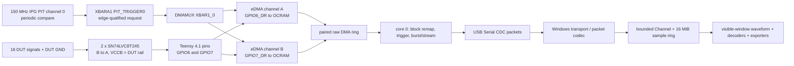

# LogicScope architecture

## Status and engineering boundaries

LogicScope is a reference implementation for a Teensy 4.1 / i.MX RT1062 sampler and a Windows host. It deliberately distinguishes what the silicon can do from performance figures that still require bench characterization. The requested specification contains three hardware-level contradictions; this repository does not paper over them:

1. **The RT1062 has one Cortex-M7 core, not two.** Firmware therefore runs the command parser, sample-block packing, trigger state machine and USB service cooperatively on core 0. DMA moves each sample; neither the command parser nor the CPU reads a GPIO register per sample. A dual-core split requires a different MCU (for example, an RT117x) and is not implementable on a Teensy 4.1.
2. **The requested 16K × 4 dual-bank raw ring does not fit the Teensy 4.1's DMA RAM.** Each logical sample needs one 32-bit read from GPIO6 and one from GPIO7 before CPU remapping (8 bytes/sample). Four 16K-sample slots would consume 512 KiB of OCRAM alone, before TCD descriptors and the Teensy USB stack. The firmware uses four smaller paired DMA blocks and reports the actual packed burst capacity. Increasing the block count/size requires more DMA-accessible RAM (for example, a designed and validated external-memory implementation), not just a linker flag.
3. **The requested 1 MiB burst is not provisioned by this build.** At two bytes per logical sample, 1 MiB would hold 524,288 samples, before stack, USB, DMA, and application state. This firmware reserves 131,072 packed samples (256 KiB) and four 8,192-sample blocks in each raw DMA bank (256 KiB combined); it reports only the packed capacity it actually accepts. The paired raw ring is transient and is not multiplied by the entire capture depth, but a larger burst needs a deliberate memory/linker design and an on-target map-file check.

The Teensy 4.1 device USB controller supports high-speed USB; the 30–35 MB/s figure is a *target*, not a result proven by this source tree. USB CDC throughput depends on the exact Teensyduino core, host controller, driver, packet size, and continuous DMA/packing load. `GET_CAPS` advertises firmware limits, not an independently measured throughput certificate. Before relying on any rate, run the supplied loopback test and characterize pin-to-pin skew, DMA request loss, buffer overruns, and USB throughput with an oscilloscope/host benchmark.

## Data path

The PIT is a hardware pacing source. Its XBAR request triggers both eDMA channels. The channels issue one 32-bit read per trigger from `GPIO6_DR` and `GPIO7_DR`. Sampling jitter is consequently governed by the timer and eDMA arbitration, not by a GPIO read in an ISR. The interrupt runs once per DMA block, not once per sample. The two reads are separate bus transactions; simultaneous XBAR triggering does **not** make them an electrically simultaneous, zero-skew latch. Characterize and publish the measured inter-bank skew before treating sub-sample timing as meaningful.

## Firmware execution model

- `dma_sampler.cpp` configures input mux/GPIO direction through `pinMode`, enables PIT/XBAR clocks, connects `PIT_TRIGGER0` to the XBAR DMA request, and configures a pair of eDMA channels with circular scatter/gather TCDs.
- The DMA ISR only acknowledges the completed channel, marks its half-pair ready, and detects a ring slot that was not released in time. It does not read the GPIO data registers or pack samples.
- `main.cpp` claims a completed pair, invalidates its cache lines, maps GPIO6/GPIO7 bits to logical D0–D15, runs the trigger state machine, and sends bounded USB packets.
- `protocol.cpp` parses the binary serial commands. The parser is a cooperative service on the single M7 core; it is intentionally not described as “core 1.”
- The on-board 1 MHz self-test outputs use hardware PWM on pins 22/23. They are test outputs, not a substitute for a calibrated input source; loop them to DUT-side test pads only with the board's VCCB/voltage conditions respected.

The DMA ring has explicit slot ownership (`empty`, bank-half-ready, ready, busy). At each block interrupt, the ISR checks the next TCD destination and stops the timer/DMA if the consumer has not released that slot, before normal operation reaches the overwrite. A sequence number also lets the PC detect missing/reordered USB packets; the terminal status reports a DMA overrun. The bounded ring and interrupt latency still need on-target stress testing—no silent “lossless” guarantee is made when the producer exceeds the consumer.

## Packed sample mapping

Only the DMA engine reads `GPIO6_DR` and `GPIO7_DR` during acquisition. The CPU remaps those saved words after a whole block completes. Logical bit 0 of each 16-bit sample is channel 0, bit 15 is channel 15. See [hardware.md](hardware.md) for the pin/core-map erratum and the full table.

## Windows data path

`LogicScope.Hardware` owns COM-port discovery, GET_CAPS handshake and byte-exact packet parsing. `LogicScope.Core` accepts blocks through a bounded `Channel<T>` and stores samples in a fixed 16 MiB ring. The UI never asks the renderer to copy the entire capture: it supplies a sample-index/time window, and the renderer aggregates that window to the current pixel width. Decoders operate on an explicit window; large-capture decodes are not silently run on the whole file.

The WPF view is MVVM-based, uses a shared dark resource dictionary, and draws digital traces on a SkiaSharp surface. File writers are isolated in `LogicScope.Export`; decoder implementations share one base class in `LogicScope.Decode`.

## Project map

- `firmware/` — PlatformIO Teensy 4.1 project, hardware DMA sampler, trigger, CDC protocol/TX, and self-test.
- `docs/` — architecture, hardware front end/pinout, binary protocol, and file-format caveats.
- `app/LogicScope.sln` — Core, Hardware, Decode, Export, WPF App, and xUnit tests.
- `tests/` — firmware self-test procedure plus the host unit-test project.

## Bring-up/acceptance checklist

1. Confirm the exact Teensyduino/PlatformIO core revision and inspect the linked map file for `.dmabuffers` headroom.
2. Verify input pins and all translator channels with static 0/1 levels at VCCB = 1.8 V, 3.3 V, and 5.0 V before applying a fast clock.
3. Run firmware self-test with external loopback jumpers and confirm channel order in the PC app.
4. Sweep PIT divider rates while observing both raw clocks and GPIO strobe instrumentation. Confirm no DMA request loss, stable bank skew, and no ring overrun.
5. Measure CDC throughput using the app's byte/sample counters, then set released capability values to the highest rate with zero sequence gaps and zero DMA overruns over a documented soak test.
6. Repeat with trigger, decoders, file writing and the exact intended Windows USB controller; publish firmware/core versions and test data with any release.
